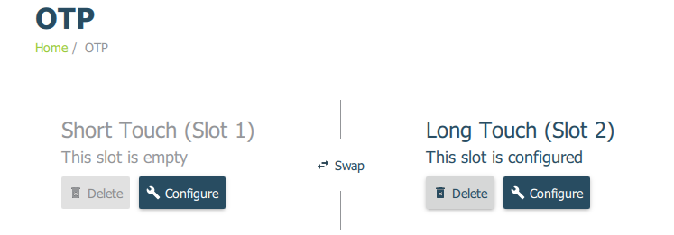

Windows GPG Yubikey Config for Putty/SSH
----------------------------------------
Configure yubikey for SSH authentication on windows. Assumes [Yubikey has GPG
key pre-loaded](README.md).

Required Materials
------------------
1. [gpg4win][1] downloaded. **Verify Integrity**.
1. [Yubikey Manager][2] installed. Only required if you are changing keypress
   and NFC settings.
1. [Putty][3] installed.
1. Pre-configured Yubikey.

### Install GPG4Win on machine
This will provide GPG interactions as well as an agent to provide key material
to putty, winscp, etc.

1. Only install **gnupg**

Configure Yubikey
-----------------
Configure behavior of Yubikey so short touches will provide GPG material, while
long touches will provide Yubico OTP. This prevents accidental touches spewing
keystrokes into whatever is open. NFC is also disable.

1. Open Yubikey Manager
1. Select `Applications > OTP`
1. Delete `Slot 1`
1. Configure `Slot 2` to use `Yubico OTP`

Results should look like this:


If your key has NFC support, this can be disabled as well.

1. Open Yubikey Manager
1. Select `Interfaces`
1. Uncheck **all** NFC options
1. Click `Save Interfaces`

Results should look like this:


Configure GPG Agent
-------------------
This will configure the GPG agent on the windows machine to provide certificates
from the Yubikey.

### Import & Ultimate Trust Your Certificate
This will set ultimate trust for the [GPG public][6] certificate you created
when making your GPG key.

Open a command shell `win+x > command prompt`
```cmd
gpg --import YOUR_PUBLIC_GPG_KEY.asc
gpg --list-key
gpg --edit-key KEYID
trust
5
save
gpg --list-secret-keys
```
* KEYID is listed from `--list-key`
* `--list-secret-keys` should show `#` for private cert not on machine, and `>`
  for your signing, authentication and encryption certs on the Yubikey.

### Setup GPG Agent for SSH and Putty
This will enable SSH and Putty usage with the gpg-agent.

%appdata%\gnupg\gpg-agent.conf
```
enable-ssh-support
enable-putty-support
```

### Restart GPG Agent and Connect Agent
This will apply [configuration changes][4] made.
```cmd
gpgconf --kill gpg-agent
"c:\Program Files (x86)\GnuPG\bin\gpg-connect-agent.exe" /bye
```

Configure Putty
---------------
Ensure yubikey is readable by GPG. This assumes you have setup your _exported
GPG ssh key_ on the server you are connecting to already (e.g.
~/.ssh/authorized_keys).

```cmd
gpg --card-status
```
* If the Yubikey does not appear, reinsert the key.

### Setup Putty
Configure a host as your normally would. Ensure these additional optiosn are
enabled:

* Check `Connection > SSH > Auth` > Attempt authentication using Pageant
* Remove `Connection > SSH > Auth` > Private key file for authentication

Be sure to **save** your configuration changes.

### Logging In

1. Connect with putty as normal.
1. a `PinEntry` pop-up window should appear. It may not be in focus. Enter your
   **User PIN**. Click `OK`.

   
   * Number is the Yubikey serial number.
   * Holder is the First/Last name of the GPG certificate on the key.

1. There _will be no prompt_. **Tap Your Key**. If successful you will login.

Run GPG Agent on Login
----------------------
Setup a [scheduled job][7] to ensure gpg-agent is automatically running on
login.

Powershell as Admin
```powershell
$job = Register-ScheduledJob `
   -Name GpgAgent `
   -ScriptBlock { gpg-connect-agent.exe /bye } `
   -Trigger (New-JobTrigger -AtLogOn -User $([System.Security.Principal.WindowsIdentity]::GetCurrent().Name)) `
   -ScheduledJobOption (New-ScheduledJobOption -StartIfOnBattery -ContinueIfGoingOnBattery) `
   -RunNow

# Change principal to run only on interactive logon instead of S4A.
$principal = New-ScheduledTaskPrincipal -LogonType Interactive -UserId $([System.Security.Principal.WindowsIdentity]::GetCurrent().Name)
Set-ScheduledTask -TaskPath \Microsoft\Windows\PowerShell\ScheduledJobs\ -TaskName $job.Name -Principal $principal
```
* This also ensures it is started on power resume / on battery.

Errors & Problems
-----------------
### SSH connection failed, Server sent: publickey
Happens because of a standard publickey not provided / matched failure.

1. SSH public key is not loaded on the SSH server. Confirm your public SSH key
   (exported from GPG with `--export-ssh-key`) is added to `authorized_keys` for
   the user you are attempting to login with.
1. GPG agent configuration is not reloaded. Ensure ssh and putty support in
   configuration is set and `gpg-agent` and `gpg-connect-agent` are both
   restarted.

### Please insert card with serial number


Occurs because the original key used for authentication is not the key being
used now. [GPG Agent caches the serial number][5] of the card for the KeyStub
used. This just needs to be removed.

1. Show all keygrips in GPG, these will be used to match cache in private store.
   ```cmd
   gpg --with-keygrip --list-keys
   ```
1. Identify keygrip in `%appdata%\gnupg\private-keys-v1.d\` and delete it, or
   you can just remove all keys in that directory.

[1]: https://www.gpg4win.org/package-integrity.html
[2]: https://www.yubico.com/products/services-software/download/yubikey-manager/
[3]: https://www.putty.org/
[4]: https://superuser.com/questions/1075404/how-can-i-restart-gpg-agent
[5]: https://security.stackexchange.com/questions/165286/how-to-use-multiple-smart-cards-with-gnupg
[6]: https://stackoverflow.com/questions/31784368/how-to-give-highest-trust-level-to-an-openpgp-certificate-in-kleopatra
[7]: https://www.kaylyn.ink/journal/windows-using-gpg-for-ssh-authentication-and-git/

[8]: https://developers.yubico.com/PGP/SSH_authentication/Windows.html
[9]: https://www.linode.com/docs/security/authentication/gpg-key-for-ssh-authentication/
[10]: https://codingnest.com/how-to-use-gpg-with-yubikey-wsl/
[11]: https://ttmm.io/tech/yubikey/
[12]: https://occamy.chemistry.jhu.edu/references/pubsoft/YubikeySSH/index.php