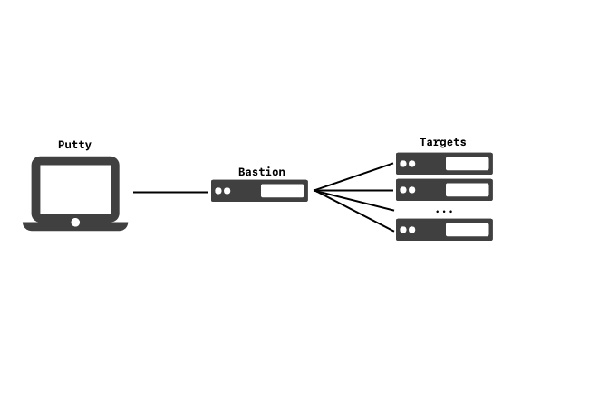

Windows GPG Yubikey Config for Putty/SSH
----------------------------------------
Configure yubikey for SSH authentication on windows. Assumes [Yubikey has GPG
Subkeys pre-loaded](README.md).

* [Creating GPG Keys][1]
* [Export GPG Subkeys to Yubikey][2]
* [Windows GPG Yubikey Setup][3]
* [Ubuntu GPG Yubikey Setup][4]

1. [Required Materials](#required-materials)
1. [Configure Yubikey](#configure-yubikey)
1. [Configure GPG Agent](#configure-gpg-agent)
1. [Configure Putty](#configure-putty)
1. [Run GPG Agent on Login](#run-gpg-agent-on-login)
1. [Forward GPG Agent to Multiple Sub-Servers](#foward-gpg-agent-to-multiple-sub-servers)
1. [Errors & Problems](#errors---problems)

Required Materials
------------------
1. [gpg4win][5] downloaded. **Verify Integrity**.
1. [Yubikey Manager][6] installed. Only required if you are changing keypress
   and NFC settings.
1. [Putty][7] installed.
1. Pre-configured Yubikey.

### Install GPG4Win on machine
This will provide GPG interactions as well as an agent to provide key material
to putty, winscp, etc.

1. Only install **gnupg**

### Add GPG to User Path
This will enable you to use commands anywhere on the system. Path is modified
using the [System Preferences][ref6] control panel plugin.

1. `win+r > sysdm.cpl > Advanced > Environment Variables`
1. Select `Path` under `User Variables`, click `edit`
1. Click `new` add `C:\Program Files (x86)\GnuPG\bin`
1. Ensure path is added at end of list and save.

Configure Yubikey
-----------------
Configure behavior of Yubikey so short touches will provide GPG material, while
long touches will provide Yubico OTP. This prevents accidental touches spewing
keystrokes into whatever is open. NFC is also disable.

1. Open Yubikey Manager
1. Select `Applications > OTP`
1. Delete `Slot 1`
1. Configure `Slot 2` to use `Yubico OTP`

Results should look like this:


If your key has NFC support, this can be disabled as well.

1. Open Yubikey Manager
1. Select `Interfaces`
1. Uncheck **all** NFC options
1. Click `Save Interfaces`

Results should look like this:


Configure GPG Agent
-------------------
### Import & Ultimate Trust Your Certificate
This will set ultimate trust for the [GPG public][12] certificate you created
when making your GPG key.

Open a command shell `win+x > command prompt`
```cmd
gpg --import YOUR_PUBLIC_GPG_KEY.asc
gpg --list-key
gpg --edit-key KEYID
trust
5
save
gpg --list-secret-keys
```
* `gpg --card-edit; fetch` will pull the GPG public key from the [URL
  provided][8] on the yubikey. This is better if you are using from multiple or
  new machines.
* KEYID is listed from `--list-key`
* `--list-secret-keys` should show `#` for private cert not on machine, and `>`
  for your signing, authentication and encryption certs on the Yubikey.

### Setup GPG Agent for SSH and Putty
This will enable SSH and Putty usage with the gpg-agent.

%appdata%\gnupg\gpg-agent.conf
```
enable-ssh-support
enable-putty-support
```

### Restart GPG Agent and Connect Agent
This will apply [configuration changes][9] made.
```cmd
gpgconf --kill gpg-agent
"c:\Program Files (x86)\GnuPG\bin\gpg-connect-agent.exe" /bye
```

Configure Putty
---------------
Ensure yubikey is readable by GPG. This assumes you have setup your _exported
GPG ssh key_ on the server you are connecting to already (e.g.
~/.ssh/authorized_keys).

```cmd
gpg --card-status
```
* If the Yubikey does not appear, reinsert the key.

### Setup Putty
Configure a host as your normally would. Ensure these additional optiosn are
enabled:

* Check `Connection > SSH > Auth` > Attempt authentication using Pageant
* Remove `Connection > SSH > Auth` > Private key file for authentication

Be sure to **save** your configuration changes.

### Logging In

1. Connect with putty as normal.
1. a `PinEntry` pop-up window should appear. It may not be in focus. Enter your
   **User PIN**. Click `OK`.

   
   * Number is the Yubikey serial number.
   * Holder is the First/Last name of the GPG certificate on the key.
   * Your key will blink when waiting for password or touch.

1. There _will be no prompt_. **Tap Your Key**. If successful you will login.

Run GPG Agent on Login
----------------------
Scheduled Tasks are inconsistently applied and therefore you will run into
issues if you depend on the scheduled tasks to always run at login to refresh
your GPG agent. This is compounded by GPG agent occasionally hanging and needing
to be force restarted. This is remedied by triggering GPG agent refresh on
screen unlock events, ensuring that the agent is always ready.

[See in-depth instructions here][10]; or just follow these.

### Enable Login/Logoff Events
Logon/Logoff events are not configured to log by default. When enabled,
successful unlock events will have an ID of `4801`, and event login failures
will have an ID of `4800`. The unlock event will trigger at screen unlock as
well as logging into the machine.

```win + r > gpedit.msc```
> Key: Computer Configuration > Windows Settings > Security Settings > Advanced Audit Policy Configuration > System Audit Policies - Local Group Policy Object > Logon/Logoff

> Policy: Audit Other Login/Logoff Events > Success = Enabled

> Policy: Audit Other Login/Logoff Events > Failure = Enabled.

### Create Event Triggered Scheduled Task
See [detailed documentation][10] for setup and additional details. This will
create a scheduled task that will refresh the GPG agent on screen unlock.

Run [this script][14] in powershell as admin. [Don't blindy trust and assume the
script is not malicious][10] -- vet the script first.

Forward GPG Agent to Multiple Sub-Servers
-----------------------------------------
This is effectively using a single server as an SSH Bastion and SSH'ing to
additional machines through the bastion. Please note that while the connection
is active, it is possible to [**use them as you while you are connected**][13];
so a secured and monitored system should be used, if at all. Machines are
referred to as `putty` for your client machine, `bastion` for the machine you
will be SSH'ing through and `target` for remote SSH targets.



### Putty
* Ensure `Connection > SSH > Auth > Allow agent forwarding` is enabled.

### Bastion
/etc/ssh/sshd_config
```bash
StreamLocalBindUnlink yes
AllowAgentForwarding yes
```
* _Exported GPG ssh key_ added to `authorized_keys` file for user.
* This will allow you to forward your credentials again to the next server.
* Removes current socket file for forwarding before creating a new one.
* Confirm new settings loaded with `sshd -T | grep -i allowagent`

### Target
* _Exported GPG ssh key_ added to `authorized_keys` file for user.

/etc/ssh/sshd_config
```bash
AllowAgentForwarding no
```
* Target does not need to enable outbound agent forwarding for this to work.

Errors & Problems
-----------------
### SSH connection failed, Server sent: publickey
Happens because of a standard publickey not provided / matched failure.

1. SSH public key is not loaded on the SSH server. Confirm your public SSH key
   (exported from GPG with `--export-ssh-key`) is added to `authorized_keys` for
   the user you are attempting to login with.
1. GPG agent configuration is not reloaded. Ensure ssh and putty support in
   configuration is set and `gpg-agent` and `gpg-connect-agent` are both
   restarted.

### Please insert card with serial number


Occurs because the original key used for authentication is not the key being
used now. [GPG Agent caches the serial number][11] of the card for the KeyStub
used. This just needs to be removed.

1. Show all keygrips in GPG, these will be used to match cache in private store.
   ```cmd
   gpg --with-keygrip --list-keys
   ```
1. Identify keygrip in `%appdata%\gnupg\private-keys-v1.d\` and delete it, or
   you can just remove all keys in that directory.

[1]: README.md
[2]: yubikey.md
[3]: windows.md
[4]: ubuntu.md
[5]: https://www.gpg4win.org/package-integrity.html
[6]: https://www.yubico.com/products/services-software/download/yubikey-manager/
[7]: https://www.putty.org/
[8]: https://withinboredom.info/2017/11/18/signing-commits-ssh-with-yubikey-and-windows/
[9]: https://superuser.com/questions/1075404/how-can-i-restart-gpg-agent
[10]: ../../operating-systems/windows/10/scheduled-tasks/README.md
[11]: https://security.stackexchange.com/questions/165286/how-to-use-multiple-smart-cards-with-gnupg
[12]: https://stackoverflow.com/questions/31784368/how-to-give-highest-trust-level-to-an-openpgp-certificate-in-kleopatra
[13]: http://www.unixwiz.net/techtips/ssh-agent-forwarding.html
[14]: ../../operating-systems/windows/10/scheduled-tasks/gpg-agent-refresh-unlock.ps1

[ref1]: https://developers.yubico.com/PGP/SSH_authentication/Windows.html
[ref2]: https://www.linode.com/docs/security/authentication/gpg-key-for-ssh-authentication/
[ref3]: https://codingnest.com/how-to-use-gpg-with-yubikey-wsl/
[ref4]: https://ttmm.io/tech/yubikey/
[ref5]: https://occamy.chemistry.jhu.edu/references/pubsoft/YubikeySSH/index.php
[ref6]: https://ss64.com/nt/run.html
[ref7]: https://superuser.com/questions/161973/how-can-i-forward-a-gpg-key-via-ssh-agent