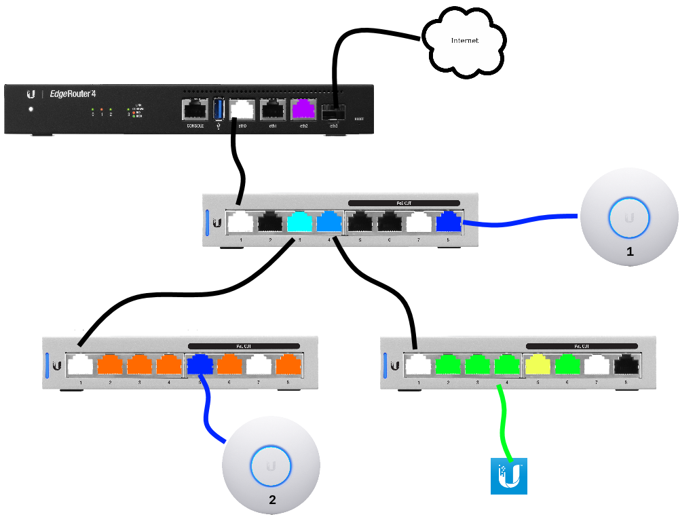

Edgerouter Docker Unifi Controller VLAN Setup
=============================================
Example walkthorugh of creating a VLAN based network using an edgerouter as a
router/firewall with a Docker Unifi Controller managing Unifi Switch/APs.

1. [Network Overview](#network-overview)
1. [Before You Begin](#before-you-begin)
1. [Configuration](#configuration)
1. [Moving Setup to Docker Controller](#moving-setup-to-docker-controller)
1. [Unifi Device Troubleshooting](#unifi-device-troubleshooting)

Network Overview
----------------
See [VLANS 101][dv] for detailed VLAN concept information.

### Physical Layout
The example network ([ascii diagram][p1]) will be laid out as follows:



| Color      | Network        |
|------------|----------------|
| White      | Trunk: All     |
| Purple     | Local Router   |
| Teal       | Trunk: Wired   |
| Light Blue | Trunk: Server  |
| Dark Blue  | Trunk: Wifi    |
| Orange     | Wired          |
| Green      | Server         |
| Yellow     | Infrastructure |

### VLAN Table

| Network Name   | VLANID | Network       | Router   | DHCP Start | DHCP End   | DNS      |  Usage/Notes                                                    |
|----------------|--------|---------------|----------|------------|------------|----------|-----------------------------------------------------------------|
| Management     | 1      | 10.1.1.0/24   | 10.1.1.1 | 10.1.1.10  | 10.1.1.240 | 10.1.1.1 | Untagged traffic (VLAN1). Management traffic.                   |
| Wired          | 2      | 10.2.2.0/24   | 10.2.2.1 | 10.2.2.10  | 10.2.2.240 | 10.2.2.1 | General use network for hard-wired devices. No hosted services. |
| IOT            | 3      | 10.3.3.0/24   | 10.3.3.1 | 10.3.3.10  | 10.3.3.240 | 10.3.3.1 | Internet of Shit devices. Internet only. Peer Isolation.        |
| Wifi           | 4      | 10.4.4.0/24   | 10.4.4.1 | 10.4.4.10  | 10.4.4.240 | 10.4.4.1 | Wifi Network. Internet only. Peer Isolation.                    |
| Server         | 5      | 10.5.5.0/24   | 10.5.5.1 | 10.5.5.10  | 10.5.5.240 | 10.5.5.1 | Servers running general services to be used.                    |
| Infrastructure | 9      | 10.9.9.0/24   | 10.9.9.1 | 10.9.9.10  | 10.9.9.240 | 10.9.9.1 | Critical always-on infastructure-only services like DNS, DHCP.  |

### Switch Port Profiles
Profiles are applied to switch ports to define traffic allowed through the port.

| Name           | PoE | Native Network | Tagged Networks        | Voice Network |
|----------------|-----|----------------|------------------------|---------------|
| infrastructure | N/A | infrastructure | None                   | None          |
| iot            | N/A | iot            | None                   | None          |
| server         | N/A | server         | None                   | None          |
| wifi           | N/A | wifi           | None                   | None          |
| wired          | N/A | wired          | None                   | None          |
| trunk-server   | Off | LAN            | server, infrastructure | None          |
| trunk-wired    | Off | LAN            | wired, wifi            | None          |
| trunk-wifi     | PoE | LAN            | wifi                   | None          |

### Infrastructure IPs
IP assignments on management network.

| Device        | IP        | Name   |
|---------------|-----------|--------|
| Core Switch   | 10.1.1.5  | core   |
| Server Switch | 10.1.1.6  | server |
| Wired Switch  | 10.1.1.7  | wired  |
| Unifi AP 1    | 10.1.1.70 | wifi1  |
| Unifi AP 2    | 10.1.1.75 | wifi2  |
| Edgerouter    | 10.1.1.1  | edge   |

Before You Begin
----------------
Note and prep these things before starting:

* Always set an spare port on your router with a static management address
  without VLANS so you can get in if something breaks.
* Set a spare port on switches for _management VLAN_ or _ALL_ access so you can
  locally manage devices if something goes wrong.
* Make _backups of existing Edgerouter & Unifi Controller configs_. Export all
  data.
* Install Unifi controller on a laptop.
* Set static IP for laptop, on the _management network_.
* Always factory-reset equipment before configuring. This garantees fresh state.
* Always physically label your switch ports so you can easily remember them when
  you come back in a year.
* Switches/APs/Routers should always have static IP information set, so they are
  at a known address if they ever get mis-configured. Plan and document static
  IPs for these devices before implementation.

Configuration
-------------
Steps must be completed in order. Reference network diagram and VLAN table
above.

1. [Initial Edgerouter Configuration][1a].
1. [Unifi Controller Setup][8x].
1. [Core Switch Setup][i9].
1. [Server Switch Setup][8j].
1. [Wired Switch Setup][lx].
1. [Unifi Controller Wifi Setup][l3].
1. [Unifi APs Setup][5b].

Moving Setup to Docker Controller
---------------------------------
* Reset Unifi Controller to fresh install on Docker.

### Setup Unifi Docker [Container IP on DHCP][pD]
* Connect to Edgerouter GUI @ http://10.1.1.1.

#### `Services > DHCP Server > Management > Action > View Details`
* Unifi Controller: {DOCKER UNIFI CONTAINTER IP}

### Export laptop Unifi Controller settings
* Connect to Unifi GUI @ http://localhost:8443.

#### `Settings > Maintenance > Backup`
* Backup Rentation Data: `Settings only` Download.
* Shutdown laptop Unifi Controller.

### Import config to docker Unifi Container
* Connect to Unifi GUI @ http://{DOCKER UNIFI CONTAINER IP}:8443
* Load import data on initial startup.

### Set correct inform IP in docker container.

#### `Settings > Controller > Controller Hostname/IP`
* {DOCKER UNIFI CONTROLLER IP}

### Manual Update inform URI for each device
* SSH to each device (using static IP) and set correct inform URI. These should
  now auto adopt when they contact the new inform URI.

```bash
ssh {DEVICE USER}@{DEVICE IP}
info
set-inform http://{DOCKER UNIFI IP}:8080/inform
```

Unifi Device Troubleshooting
----------------------------
### Slow Adoption
On initial adoption the switch may be adopted multiple times as it is configured
by the Unifi Controller. Adoption takes a few minutes and may look like it is
failing. Generally this will be 3-5 minutes with typically 2 power cycles for
it to finish.

* _Wait_ 3-5 minutes or 2-3 cycles.

### Adoption Failure
Controller is directly connected device, but consistently fails adoption. This
is caused by the controller getting wedged.

* _Restart_ the controller.

### Consistenly Failing Repeated Adoptions
Once hardware has the _Management VLAN_ set in device configuration `Properties
> config > services > vlan > management vlan`, the Unifi controller must be
listening a _management vlan_ for the controller to be adopted.

* Ensure controller is on port that allows same VLAN traffic as the _management
  vlan_ set in the hardware.
* Ensure controller is listening on the correct IP.
* Ensure the hardware is set to inform to the correct controller IP.
* Alternatively, directly connect the unifi controller to the switch with the
  AP connected to it.

### Cannot Set Port Name
Port names cannot be the same name as the profile name being used.

### CPU Load is Extremely High on Unifi Switch
Unifi Switches run a realtime OS, and you will see consistent CPU utilization
[regardless of swtich load][Wx]. This is an artifact of how load is measured.
Nothing is wrong.

### DHCP Not Working
Typically a MAC address caching issue, or Trunking ports are swapped/wrong.

#### Caching Issue
Caused by swapping networks with the same device too quickly, or caches not
being expired when new VLANS setup.

1. Physically disconnect device from network, wait a few seconds and re-connect.
   If it works, you're done.
1. Restart DHCP services on the edgerouter.

Open a _CLI_ terminal from the EdgeOS GUI and restart DHCP.
```edgeos
sudo service dhcpd restart
```

#### Trunking ports Swapped/Wrong
Trunk VLANs do not match on Upstream or Downstream ports. If DHCP was confirmed
working before final placement, it's probably a swapped connection.

Verify the device downstream is the _correct device_ using the _same trunk port
profile_.

##### `Devices > Upstream Switch > Properties > Ports`
* `Hoverover` _status_ indicator.
* Verify
  * Downlink: Expected Switch
  * Profle: Expected Switch Port Profile

##### `Devices > Downstream Switch > Properties > Ports`
* `Hoverover` _status_ indicator.
* Verify
  * Downlink: Expected Switch
  * Profle: Expected Switch Port Profile

[p1]: example-network-diagram.md
[dv]: vlans-101.md
[1a]: edgerouter-vlan.md
[8x]: unifi-controller-vlan.md
[i9]: core-swtich.md
[l3]: unifi-controller-wifi.md
[5b]: unifi-ap.md
[8j]: server-switch.md
[lx]: wired-switch.md
[pD]: https://help.ubnt.com/hc/en-us/articles/204909754-UniFi-Device-Adoption-Methods-for-Remote-UniFi-Controllers#7
[Wx]: https://community.ubnt.com/t5/UniFi-Routing-Switching/UniFI-Switch-8-POE-60-W-constant-high-CPU-utilization/td-p/2397994

[ref4r]: https://dl.ubnt.com/guides/UniFi/UniFi_Controller_V5_UG.pdf
