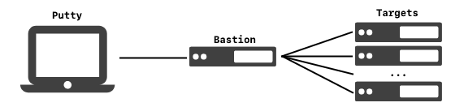

.. _gpg-windows:

Windows GPG Yubikey
###################
Configure Yubikey for SSH authentication on windows.

Required Materials
******************
#. `gpg4win`_ downloaded. **Verify Integrity**.
#. `Yubikey manager`_ installed. Only required if you are changing keypress and
   NFC settings.
#. `Putty`_ installed.
#. Pre-configured Yubikey using :ref:`gpg-export-to-yubikey`.

Configure GPG4win
*****************
This will provide GPG interactions as well as an agent to provide key material
to putty, winscp, etc.

The system path is modified using the `system preferences control panel plugin`_
to enable gpg use anywhere on the system.

Download :download:`gpg4win <https://www.gpg4win.org/package-integrity.html>`
and **verify integrity**.

.. gui:: Add gpg to user system path
  :nav:    ⌘ --> sysdm.cpl
  :path:   Advanced -->
           Environment Variables -->
           User variables for {USER} -->
           Path -->
           Edit -->
           New
  :value0: Path, c:\Program Files (x86)\GnuPG\bin
  :update: 2021-02-19

  GPG path should be added to end of list.

Configure GPG Agent
*******************
This will enable SSH and Putty usage with the gpg-agent.

.. code-block:: powershell
  :caption: ``%appdata%\gnupg\scdaemon.conf``

   reader-port Yubico YubiKey OTP+FIDO+CCID 0

.. note::
  ``Yubico YubiKey OTP+FIDO+CCID 0`` is the device name as listed in Device
   Manager. This prevents Windows Hello from attempting to act as an pagent
   device (resulting in no key found errors).

   :cmdmenu:`start --> Device Manager --> View --> Show Hidden Devices`
   :cmdmenu:`start --> Device Manager --> Software Devices`

   The name to use will be the full Yubikey device name.

.. code-block:: powershell
  :caption: ``%appdata%\gnupg\gpg-agent.conf``

  enable-ssh-support
  enable-putty-support

.. _gpg-windows-restart-agent:

.. code-block:: powershell
  :caption: Restart GPG Agent and Connect Agent to apply
            `configuration changes`_ (powershell).

  gpgconf --kill gpg-agent
  "c:\Program Files (x86)\GnuPG\bin\gpg-connect-agent.exe" /bye

Configure Putty
***************
Configure a host in putty and ensure the following options are set:

.. gui::   Use pageant for Putty Auth
  :path:   Putty --> Connection --> SSH --> Auth
  :value0: ☑, Attempt authentication using Pageant
  :value1: ›, Private key file for authentication

Be sure to **save** your configuration changes.

Verify Putty Works
******************
Ensure Yubikey is readable by GPG. This assumes you already setup:

  #. ``~/.ssh/authorized_keys`` on the target machine with your *exported* GPG
     SSH RSA Public Key; see :ref:`gpg-export-keys`. Reference
     :ref:`service-ssh` for remote SSH configuration.
  #. **Trusted** the GPG
     Master Public Key on the local machine; see
     :ref:`gpg-import`.

#. Connect with putty as normal.
#. A ``Pin Entry`` pop-up window should appear. It may not be in focus. Enter
   your **user** :term:`PIN` and press :cmdmenu:`OK`.

   .. figure:: source/pinentry.png

#. There will be *no prompt* in putty, but the Yubikey will start blinking.
   **Tap** Your Key to login.

.. note::
  * Number is the Yubikey serial number.
  * Holder is the First/Last name of the GPG certificate on the key.
  * Your key will blink when waiting for password or touch.
  * Both publickey and GPG can be used in the same system at the same time for
    different connections. No specific configuration is needed.

Run GPG Agent on Login
**********************
Scheduled Tasks are inconsistently applied and therefore you will run into
issues if you depend on the scheduled tasks to always run at login to refresh
your GPG agent. This is compounded by GPG agent occasionally hanging and needing
to be force restarted. This is remedied by triggering GPG agent refresh on
screen unlock events, ensuring that the agent is always ready.

See full instructions here: :ref:`w10-scheduled-tasks-inconsistencies`; or just
follow these.

#. :ref:`scheduled-tasks-logon-logoff`.
#. :ref:`scheduled-tasks-event-trigger`.

Forward GPG Agent Through Multiple Servers
******************************************
This is effectively using a single server as an SSH Bastion and SSH'ing to
additional machines through the bastion. This keeps your private credentials on
your local machine, however, while the connection is active it is possible for
`other to use them as you while you are connected`_; so a secured and monitored
system should be used. Machines are referred to as **putty** for your client
machine, **bastion** for the machine you will be SSH'ing through and **target**
for remote SSH targets.

.. gui::   Enable GPG Agent Forwarding in Putty
  :path:   Putty --> Connection --> SSH --> Auth
  :value0: ☑, Allow agent forwarding

.. code-block:: bash
  :caption: **0644 root root** ``/etc/ssh/sshd_config`` on Bastion.

  StreamLocalBindUnlink yes
  AllowAgentForwarding yes

.. note::
  * The exported GPG SSH RSA public key should be added to
    ``~/.ssh/authorized_keys`` file for the connecting user. See:
    :ref:`gpg-export-keys`.
  * This will allow you to forward your credentials again to the next server.
  * Removes current socket file for forwarding before creating a new one.

.. code-block:: bash
  :caption: Confirm new settings are loaded on Bastion.

  sshd -T | grep -i allowagent

.. code-block:: bash
  :caption: **0644 root root** ``/etc/ssh/sshd_config`` on Target.

  AllowAgentForwarding no

.. note::
  * Target does *not* need to enable outbound agent forwarding for this to work.
  * The exported GPG SSH RSA public key should be added to
    ``~/.ssh/authorized_keys`` file for the connecting user. See:
    :ref:`gpg-export-keys`.

.. rubric:: References

#. `Yubikey SSH authentication on windows <https://developers.yubico.com/PGP/SSH_authentication/Windows.html>`_
#. `GPG key for SSH authentication <https://www.linode.com/docs/guides/gpg-key-for-ssh-authentication/>`_
#. `Using GPG with Yubikey and WSL <https://codingnest.com/how-to-use-gpg-with-yubikey-wsl/>`_
#. `Yubikey <https://ttmm.io/tech/yubikey/>`_
#. `Yubikey SSH <https://occamy.chemistry.jhu.edu/references/pubsoft/YubikeySSH/index.php>`_
#. `Forwarding GPG key with SSH <https://superuser.com/questions/161973/how-can-i-forward-a-gpg-key-via-ssh-agent>`_

.. _gpg4win: https://www.gpg4win.org/package-integrity.html
.. _Yubikey manager: https://developers.yubico.com/yubikey-manager/
.. _Putty: https://www.putty.org/
.. _configuration changes: https://superuser.com/questions/1075404/how-can-i-restart-gpg-agent
.. _other to use them as you while you are connected: http://www.unixwiz.net/techtips/ssh-agent-forwarding.html
.. _system preferences control panel plugin: https://ss64.com/nt/run.html
