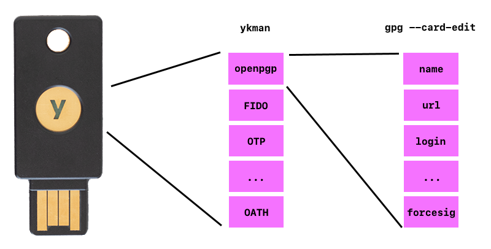

.. _gpg-export-to-yubikey:

Export GPG Subkeys to Yubikey
#############################
Exports GPG subkeys to Yubikey so master key can remain offline while still
using GPG keys. See :ref:`gpg-master` to create GPG keys and setup operating
systems to use Yubikeys for GPG key material.

Understanding How Yubikeys Work
*******************************
Read the `technical manual`_ to understand how Yubikeys work. This will setup
the Yubikey to use the ``CCID`` interface to setup ``openpgp`` on the key.

`Yubikey manager`_ is an application that is used to manage the Yubikey
itself (``ykman``) and sets *how* applets are used on the key. The configuration
of the applets themselves are managed by respective apps, in this case ``GPG``.

.. note::
  * ``ykman`` will set preferences like number of applet PIN attempts, PINs, and
    touch preferences.
  * ``gpg --edit-card`` will set openpgp configuration, like PGP name, login,
    url.

Export Subkeys to Yubikeys
**************************
.. danger::
  Exporting keys to Yubikey will **destroy** the local key. Ensure a backup has
  been made before doing this (so original state can be restored). See
  :ref:`gpg-backup` and :ref:`gpg-restore-state` respectively.

.. code-block:: bash
  :caption: Load signing key to Yubikey.
  :emphasize-lines: 1,3,16,20,25

  $ gpg --edit-key $KEYID

  gpg> key 1

  sec  rsa4096/################
       created: 2019-01-01  expires: never       usage: C
       trust: ultimate      validity: ultimate
  ssb* rsa4096/################
       created: 2019-01-01  expires: never       usage: S
  ssb  rsa4096/################
       created: 2019-01-01  expires: never       usage: E
  ssb  rsa4096/################
       created: 2019-01-01  expires: never       usage: A
  [ultimate] (1). FIRST LAST <EMAIL>

  gpg> keytocard
  Please select where to store the key:
     (1) Signature key
     (3) Authentication key
  Your selection? 1

  You need a passphrase to unlock the secret key for user: "FIRST LAST <EMAIL>"
  4096-bit RSA key, ID ################, created 2019-01-01

  gpg> save

.. note::
  Key selection is a toggle, ensure to only export *one* key at a time; this is
  denoted by a ``*``.

  First Password: GPG private key password.

  Second Password: Yubikey user term:`PIN`.

.. code-block:: bash
  :caption: Load encryption key to Yubikey.
  :emphasize-lines: 1,3,16,19,24

  $ gpg --edit-key $KEYID

  gpg> key 2

  sec  rsa4096/################
       created: 2019-01-01  expires: never       usage: C
       trust: ultimate      validity: ultimate
  ssb  rsa4096/################
       created: 2019-01-01  expires: never       usage: S
  ssb* rsa4096/################
       created: 2019-01-01  expires: never       usage: E
  ssb  rsa4096/################
       created: 2019-01-01  expires: never       usage: A
  [ultimate] (1). FIRST LAST <EMAIL>

  gpg> keytocard
  Please select where to store the key:
     (2) Encryption key
  Your selection? 2

  You need a passphrase to unlock the secret key for user: "FIRST LAST <EMAIL>"
  4096-bit RSA key, ID ################, created 2019-01-01

  gpg> save

.. note::
  Key selection is a toggle, ensure to only export *one* key at a time; this is
  denoted by a ``*``.

  First Password: GPG private key password.

  Second Password: Yubikey user term:`PIN`.

.. code-block:: bash
  :caption: Load authentication key to Yubikey.
  :emphasize-lines: 1,3,16,19,24

  $ gpg --edit-key $KEYID

  gpg> key 3

  sec  rsa4096/################
       created: 2019-01-01  expires: never       usage: C
       trust: ultimate      validity: ultimate
  ssb  rsa4096/################
       created: 2019-01-01  expires: never       usage: S
  ssb  rsa4096/################
       created: 2019-01-01  expires: never       usage: E
  ssb* rsa4096/################
       created: 2019-01-01  expires: never       usage: A
  [ultimate] (1). FIRST LAST <EMAIL>

  gpg> keytocard
  Please select where to store the key:
     (3) Authentication key
  Your selection? 3

  You need a passphrase to unlock the secret key for user: "FIRST LAST <EMAIL>"
  4096-bit RSA key, ID ################, created 2019-01-01

  gpg> save

.. note::
  Key selection is a toggle, ensure to only export *one* key at a time; this is
  denoted by a ``*``.

  First Password: GPG private key password.

  Second Password: Yubikey user :term:`PIN`.

Verify subkeys are Offloaded
****************************
Offloaded keys will have ``>`` next to the key, showing that the key is on the
card.

.. code-block:: bash

  gpg --list-secret-keys

.. _gpg-restore-state:

Restore Original GPG State
**************************
The original GPG state needs to be reloaded to export subkeys to additional
Yuibkeys, or to keep a pristine copy of GPG key data on encrypted storage.

.. code-block:: bash

  cp -avi $GPGBACKUP/* $GNUPGHOME

.. _technical manual: https://support.yubico.com/hc/en-us/articles/360016614900-YubiKey-5-Series-Technical-Manual
.. _Yubikey manager: https://developers.yubico.com/yubikey-manager/
