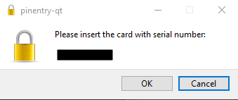

.. _gpg-troubleshooting:

Troubleshooting
###############

.. _gpg-no-agent-running:

No agent running error
**********************
``gpg-agent`` can sometimes die in the background, just restart it.

.. code-block:: bash

  gpg-agent --daemon

.. _gpg-agent-genkey:

`agent_genkey failed`_: permission denied
*****************************************
Security measure; this means that the terminal you are using is not owned by you
and therefore GPG has aborted instead of continuing. Frequently happens if
running over SSH.

.. code-block:: bash
  :caption: Set proper terminal ownership.
  :emphasize-lines: 1,5

  $ ls -la $(tty)

  crw-rw----. 1 otheruser tty 4, 1 Jan 19 18:47 /dev/pts/9

  $ sudo chown {USER} /dev/pts/9

.. _gpg-yubikey-not-appearing:

Yubikey Not Appearing
*********************
gpg-agent can lose the key if the daemon was restarted in the background or if
the Yubikey is not seated properly.

.. code-block:: bash
  :caption: Re-insert the Yubikey, then run command to verify key returns data.

  gpg --card-status

SSH connection failed, Server sent: publickey
*********************************************
SSH public key not provided or was not matched on the server.

#. SSH public key is not loaded on the SSH server. Confirm your GPG public SSH
   key (see :ref:`gpg-export-keys`) is added to ``~/.ssh/authorized_keys`` for
   the user you are attempting to login with.
#. GPG agent configuration is not reloaded. Ensure SSH and Putty support in
   configuration is set, ``gpg-agent``, and ``gpg-connect-agent`` are both
   restarted. See: :ref:`gpg-windows-restart-agent`.

Please insert card with serial number
*************************************

Occurs because the original key used for authentication is not the key being
used now. `GPG Agent caches the serial number`_ of the card for the KeyStub
used. This just needs to be removed.

.. code-block:: bash
  :caption: Show all keygrips in GPG, these will be used to match cache in private store.

  gpg --with-keygrip --list-keys

Identify keygrip in ``private-keys-v1.d`` and delete it, or you can just remove
all keys in that directory.

.. note::
  Windows Location: ``%appdata%\gnupg\private-keys-v1.d\``

  Linux Location: ``~/.gnupg/private-keys-v1.d``

.. _GPG Agent caches the serial number: https://security.stackexchange.com/questions/165286/how-to-use-multiple-smart-cards-with-gnupg
.. _agent_genkey failed: https://blog.ijun.org/2017/05/gpg-agentgenkey-failed-permission-denied.html