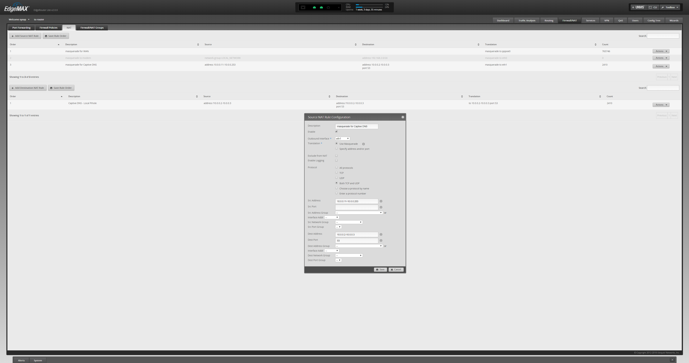

.. _networking-edge-os:

Edge OS
#######
Setup notes for Ubiquiti Edge OS.

.. danger::
  The most recent firmware update (~2019-10) has added `telemetry`_ to ubiquity
  devices; disabled by default.

  **Block or blackhole** ``trace.svc.ui.com``.

`Disable UBNT Discovery Service`_
*********************************
The UBNT Discovery Service enables other UBNT devices the ability to discover
this device.

.. danger::
  This is exposed externally and `exploitable`_. Disable this service.

.. code-block:: bash
  :caption: EdgeOS CLI.

  configure
  set service ubnt-discover disable
  set service ubnt-discover-server disable
  commit
  save

Create `DHCP Static`_ Entries
*****************************

.. dropdown:: Add static DHCP mapping via CLI.
  :color: primary
  :icon: terminal
  :animate: fade-in
  :class-container: sd-shadow-sm

  This will map ``computer`` to ``10.0.0.2`` on ``Test`` DHCP server using the
  MAC address AA:BB:CC:11:22:33.
  Changes are reflected in the GUI.

  .. code-block:: bash
    :caption: EdgeOS CLI.

    configure
    set service dhcp-server shared-network-name Test subnet 10.0.0.0/24 static-mapping computer ip-address 10.0.0.2
    set service dhcp-server shared-network-name Test subnet 10.0.0.0/24 static-mapping computer mac-address AA:BB:CC:11:22:33
    commit
    save

Create `DNS / Host`_ Entries
****************************
CNAME for IP lookups without DNS; static ``/etc/hosts`` mapping.

Simulates NAT Reflection by statically adding multiple hostnames to the hosts
file. Works with subdomains as well. This will provide an internal or custom IP
for a given DNS request.

.. important::
  Modifications should only be done via the GUI or CLI; do **not** modify
  ``/etc/hosts`` manually as these are not recognized/kept by the system across
  upgrades and restores.

.. dropdown:: Add static host mapping via CLI.
  :color: primary
  :icon: terminal
  :animate: fade-in
  :class-container: sd-shadow-sm

  This will map ``computer`` and ``computer.example.com`` to ``10.0.0.2``.
  Changes are reflected in the GUI. It will appear in ``/etc/hosts`` as:

  ``10.0.0.2  computer.example.com computer``

  :download:`create-host script <source/create-host>`.

  .. code-block:: bash
    :caption: EdgeOS CLI.

    configure
    set system static-host-mapping host-name computer.example.com inet 10.0.0.2
    set system static-host-mapping host-name computer.exmaple.com alias computer
    commit
    save

.. dropdown:: Add static host mapping via GUI.
  :color: primary
  :icon: browser
  :animate: fade-in
  :class-container: sd-shadow-sm

  .. gui::    Add Static Host
    :label:   Ubiquiti
    :path:    config tree --> system --> static-host-mapping --> host-name -->
              Add
    :value0:  host-name, {FQDN}
    :generic:
    :open:

    .. note::
      :cmdmenu:`preview` and :cmdmenu:`Apply`. When doing the initial leaf
      creation, you will get a failure message because it is not configured with
      an alias or network address yet. This is normal.

  .. gui::    Add Static Host
    :label:   Ubiquiti
    :path:    config tree --> system --> static-host-mapping --> host-name -->
              {FQDN}
    :value0:  alias, {FQDN}
    :value1:  alias, {ALIAS}
    :value2:  inet, {IP}
    :generic:
    :open:

    .. note::
      :cmdmenu:`preview` and :cmdmenu:`Apply`. Aliases should all resolve to the
      same IP (base host). Verify by resolving both names on your network.

    .. important::
      With later versions of debian based systems, entries in the local host
      file for the system will resolve to ``127.0.1.1``. `This is by design`_.

      * The alias will resolve to network IP.
      * The hostname will resolve to ``127.0.1.1``.

.. dropdown:: Add static host mapping via ``/etc/hosts``.
  :color: primary
  :icon: terminal
  :animate: fade-in
  :class-container: sd-shadow-sm

  .. danger::
    Provided only in case of need. Do not use this method as changes are not
    tracked by sysem across upgrades and restores.

  .. code-block:: bash
    :caption: **0644 root root** ``/etc/hosts`` EdgeOS CLI.

    12.12.12.12 computer.example.com computer # resolve to 12.12.12.12
    12.12.12.12 computer2.example.com computer2 # resolve to 12.12.12.12

  .. code-block:: bash
    :caption: Reload hosts file (EdgeOS CLI).

    /etc/init.d/dnsmasq force-reload

Hairpin NAT (Internal Only NAT Reflection)
******************************************
Generally split-DNS is better to use than `Hairpin NAT`_ as it allows more
control. This will enable you to redirect internal requests destined for your
external IP to another internal destination based on selected criteria. You will
need to do this for every subnet on the network.

This may be used for *faking* subdomains, assuming there is a wildcard DNS setup
on your Registrar and it resolves to your public IP.

.. gui::   Hairpin NAT (Internal Only NAT Reflection)
  :label:  Ubiquiti
  :path:   Firewall/NAT --> Port Forwarding
  :value0: WAN Interface, eth3
  :value1: Hairpin NAT, ☑ Enable hairpin NAT (also known as 'NAT loopback' or
                       'NAT reflection')
  :value2: LAN Interface, eth0.5

    .. note::
      Do not use WAN interface for the *Inbound Interface*. Defaults for
      everything else.

Deleted DHCP Host Still Resolves in DNS
***************************************
When deleting a DHCP host, the DNS reservation should be `removed as well`_.
However `there is a bug`_ in which these hosts are never deleted.

.. code-block:: bash
  :caption: **0644 root root** ``/etc/hosts`` EdgeOS CLI.

  #Delete hosts which are no longer used and reboot the router.

DNS Hostnames not Resolving
***************************
DHCP server on the edgerouter needs to update the hosts file when new IP's are
issued.

.. gui::   Enable Dynamic DNS
  :label:  Ubiquiti
  :path:   config tree --> service --> dhcp-server --> dynamic-dns-update
  :value0: Enable, true

Allow Subnet (Wifi) Traffic `Internet Only Access`_
***************************************************
May be applied to any subnet that should only have Internet access.

Create network group that contains all private IPv4 addresses.

.. gui::   Define RFC1918 Private Address Group
  :label:  Ubiquiti
  :path:   Firewall/NAT --> Firewall/NAT Groups --> Add Group
  :value0: Name, RFC1918
  :value1: Description, Private IPv4 address space
  :value2: Group Type, ☑ Network Group

.. gui::   Define Networks within RFC 1918
  :label:  Ubiquiti
  :path:   Firewall/NAT --> Firewall/NAT Groups --> RFC1918 --> Actions -->
           Config
  :value0: Network, 192.168.0.0/16
  :value1: Network, 172.16.0.0/12
  :value2: Network, 10.0.0.0/8

  .. note::
    Use :cmdmenu:`add new` to add each individual network. Be sure to
    :cmdmenu:`save`.

Prevent Wifi Traffic from Reaching Internal Networks
====================================================
.. gui::   WIFI_IN Creation
  :label:  Ubiquiti
  :path:   Firewall/NAT --> Firewall Policies --> Add Ruleset
  :value0: Name, WIFI_IN
  :value1: Description, Wifi to LAN
  :value2: Default action, ☑ Accept
  :value3: Default Log, ☐

.. gui::   Drop Wifi to LAN Basic
  :label:  Ubiquiti
  :path:   Firewall/NAT --> Firewall Policies -->
           WIFI_IN -->
           Actions -->
           Edit Ruleset -->
           Add New Rule -->
           Basic
  :value0: Description, Drop Wifi to LAN
  :value1: Action, ☑ Drop
  :value2: Protocol, ☑ All protocols

.. gui::   Drop Wifi to LAN Destination
  :label:  Ubiquiti
  :path:   Firewall/NAT --> Firewall Policies -->
           WIFI_IN -->
           Actions -->
           Edit Ruleset -->
           Drop Wifi to LAN -->
           Actions -->
           Destination
  :value0: Network Group, Private IPv4 address space

  .. note::
    This can be done in the previous step by switching tabs.

.. gui::   Drop Wifi to LAN Interface
  :label:  Ubiquiti
  :path:   Firewall/NAT --> Firewall Policies -->
           WIFI_IN -->
           Actions -->
           Interfaces
  :value0: Interface, {WIFI}
  :value1: Direction, {IN}

  .. warning::
    Ensure Interface is set to the appropriate Wifi interface or VLAN.

Only Allow DNS Traffic to Router
================================
.. gui::   Only Allow DNS Traffic to Router
  :label:  Ubiquiti
  :path:   Firewall/NAT --> Firewall Policies --> Add Ruleset
  :value0: Name, WIFI_LOCAL
  :value1: Description, Wifi to Router
  :value2: Default action, ☑ Drop
  :value3: Default Log, ☐

.. gui::   Drop Wifi to LAN Basic
  :label:  Ubiquiti
  :path:   Firewall/NAT --> Firewall Policies -->
           WIFI_LOCAL -->
           Actions -->
           Edit Ruleset -->
           Add New Rule -->
           Basic
  :value0: Description, Allow DNS
  :value1: Action, ☑ Accept
  :value2: Protocol, ☑ Both TCP and UDP

.. gui::   Drop Wifi to LAN Destination
  :label:  Ubiquiti
  :path:   Firewall/NAT --> Firewall Policies -->
           WIFI_LOCAL -->
           Actions -->
           Edit Ruleset -->
           Drop Wifi to LAN -->
           Actions -->
           Destination
  :value0: Destination, 53

  .. note::
    This can be done in the previous step by switching tabs.

.. gui::   Drop Wifi to LAN Interface
  :label:  Ubiquiti
  :path:   Firewall/NAT --> Firewall Policies -->
           WIFI_LOCAL -->
           Actions -->
           Interfaces
  :value0: Interface, {WIFI}
  :value1: Direction, {LOCAL}

  .. warning::
    Ensure Interface is set to the appropriate Wifi interface or VLAN.

.. _networking-dnat-for-captive-dns:

DNAT for `Captive DNS`_
***********************
Force `all DNS`_ queries regardless of destination server to a specific DNS
server.

.. danger::
  Do **not** enable this for the custom DNS server!

.. _networking-destination-nat:

Add a `Destination NAT Rule`_ for each interface serving internal networks:

.. gui::    Captive DNS Destination Setup
  :label:   Ubiquiti
  :path:    Firewall/NAT --> NAT --> Add Destination NAT Rule
  :value0:  Description, {CAPTIVE_DNS_NAME}
  :value1:  Enable, ☑
  :value2:  Inbound Interface, {INTERFACE}
  :value3:  Translations Address, {IP}
  :value4:  Translations Port, 53
  :value5:  Exclude from NAT, ☐
  :value6:  Enable Logging, ☐
  :value7:  Protocol, ☑ Both TCP and UDP
  :value8:  Source Address, {IP_NET_CIDR}
  :value9:  Destination Address, {!IP}
  :value10: Destination Port, 53

  .. note::
    Note the **!** to negate matching for destination address. IP is the DNS
    server.

Add `Masquerade NAT Rule`_ for each interface serving internal networks. This
enables appropriate transparent DNS lookups (Clients will think that they are
resolving from the DNS they requested, not the actual DNS server serving
responses):

:download:`local image <source/IFYUX2T.png>`.

.. gui::   Captive DNS Masquerade Setup
  :label:  Ubiquiti
  :path:   Firewall/NAT --> NAT --> Add Source NAT Rule
  :value0: Description, {CAPTIVE_DNS_NAME}
  :value1: Enable, ☑
  :value2: Outbound Interface, {INTERFACE}
  :value3: Translation, ☑ Use Masquerade
  :value4: Exclude from NAT, ☐
  :value5: Enable Logging, ☐
  :value6: Protocol, ☑ Both TCP and UDP
  :value7: Source Address, {IP_NET_CIDR}
  :value8: Destination Address, {IP}
  :value9: Destination Port, 53

Captive DNS Exceptions
======================
Allow for specific client exceptions to DNAT rules. These should be an
*exception* and not the rule. Keep this list small.

Create a *Source Address Group* to manage all clients for the exception:

.. gui::   Create Captive DNS Exceptions Group
  :label:  Ubiquiti
  :path:   Firewall/NAT --> Firewall/NAT Groups --> Add Group
  :value0: Name, {DNAT_EXCEPTION_NAME}
  :value1: Description, Disable DNAT / Captive DNS for exceptions
  :value2: Group Type, ☑ Address Group

.. gui::   Add Clients to Exceptions Group
  :label:  Ubiquiti
  :path:   Firewall/NAT --> Firewall/NAT Groups -->
           {DNAT_EXCEPTION_NAME} -->
           Actions -->
           Edit
  :value0: Address, {IP}

Add an additional `Destination NAT Rule`_ for each interface serving internal
networks:

.. gui::   Captive DNS Destination Exceptions Setup
  :label:  Ubiquiti
  :path:   Firewall/NAT --> NAT --> Add Destination NAT Rule
  :value0: Description, {CAPTIVE_DNS_EXCEPTIONS}
  :value1: Enable, ☑
  :value2: Inbound Interface, {INTERFACE}
  :value3: Translations Address, {IP}
  :value4: Translations Port, 53
  :value5: Exclude from NAT, ☐
  :value6: Enable Logging, ☐
  :value7: Protocol, ☑ Both TCP and UDP
  :value8: Source Address, {DNAT_EXCEPTION_NAME}
  :value9: Destination Port, 53

  .. warning::
    Set rule above the captive DNS rule for the specific network for the
    exception to apply. IP is router.

Custom `SSL`_ Certifcate for Webface
************************************
A custom SSL certifcate may be used to serve HTTPS router traffic. Turn on
EdgeOS SSH.

.. code-block:: bash
  :caption: Combine private key and certifcate into one file, copy to EdgeOS.

  cat privkey.pem cert.pem > server.pem

.. code-block:: bash
  :caption: Backup existing cert and restart webface (EdgeOS CLI).

  cp /etc/lighttpd/server.pem /etc/lighttpd/server.pem.Backup
  mv /tmp/server.pem /etc/lighttpd/server.pem
  kill -SIGINT $(cat /var/run/lighttpd.pid)
  /usr/sbin/lighttpd -f /etc/lighttpd/lighttpd.conf

`Dump Configuration`_ via CLI Command Export
********************************************
Export the list of CLI commands to manually re-create the current configuration
of the router.

.. code-block:: bash
  :caption: EdgeOS CLI.

  show configuration commands

`Dump Configuration`_ to JSON-like file
***************************************
Show a JSON-like representation of the current router configuration.

.. code-block:: bash
  :caption: EdgeOS CLI.

  show configuration all

.. rubric:: References

#. `Creating DNS Entries <https://community.ui.com/questions/ab712740-d579-4c89-824a-cda582a6bdd4>`_
#. `How to Create a Guest\LAN Firewall Rule <https://help.ui.com/hc/en-us/articles/218889067-EdgeMAX-How-to-Protect-a-Guest-Network-on-EdgeRouter>`_

.. _This is by design: https://bugs.debian.org/cgi-bin/bugreport.cgi?bug=316099
.. _Hairpin NAT: https://help.ui.com/hc/en-us/articles/204952134-EdgeRouter-Hairpin-NAT
.. _removed as well: https://community.ui.com/questions/DNS-resolution-of-local-hosts/3b0a70d6-aefb-44a2-872e-e3703e757cd2
.. _there is a bug: https://community.ui.com/questions/12901fe9-f520-49cc-99f7-12cbbc8d6aed
.. _SSL: https://www.stevejenkins.com/blog/2015/10/install-an-ssl-certificate-on-a-ubiquiti-edgemax-edgerouter/
.. _Internet Only Access: https://help.ui.com/hc/en-us/articles/218889067-EdgeRouter-How-to-Create-a-Guest-LAN-Firewall-Rule
.. _exploitable: https://www.zdnet.com/google-amp/article/over-485000-ubiquiti-devices-vulnerable-to-new-attack/
.. _Disable UBNT Discovery Service: https://help.ui.com/hc/en-us/articles/204976244-EdgeRouter-UBNT-Device-Discovery
.. _Dump Configuration: https://community.ui.com/questions/66768622-c0a9-4c79-9dfa-331bd0a90e90
.. _Captive DNS: https://old.reddit.com/r/pihole/comments/ahmg14/finally_set_up_a_dnat_for_hardcoded_dns/eeg114d/
.. _Masquerade NAT Rule: https://i.imgur.com/IFYUX2T.png
.. _all DNS: https://community.ui.com/questions/cd0a248d-ca54-4d16-84c6-a5ade3dc3272
.. _Destination NAT Rule: https://old.reddit.com/r/Ubiquiti/comments/6lndq4/question_redirect_port_53_to_internal_dns_server/
.. _telemetry: https://community.ui.com/questions/Update-UniFi-Phone-Home-Performance-Data-Collection/f84a71c9-0b81-4d69-a3b3-45640aba1c8b
.. _DNS / Host: https://community.ui.com/questions/Create-DNS-enteries/ab712740-d579-4c89-824a-cda582a6bdd4
.. _DHCP Static: https://help.ui.com/hc/en-us/articles/360044494093-EdgeRouter-DHCP-Server-Static-Mapping
