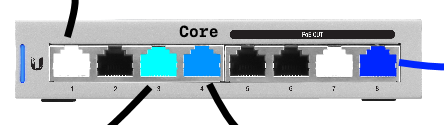

.. _core-switch-vlan-setup:

Core Switch VLAN Setup
######################
This will setup the core switch using VLANs according to example network. See
:ref:`example-network-diagram`.

.. aafig::
  :name: Unifi US-8-60W (Core).

     |    'Unifi US-8-60W (Core)'
  +--+------------------------------+
  | +-+ +-+ +-+ +-+ +-+ +-+ +-+ +-+ |
  | |A| |D| |W| |S| |D| |D| |A| |I| |
  | +-+ +-+ +-+ +-+ +-+ +-+ +-+ +-+ |
  +----------+---+---------------+--+
             |   |               |
             |   |           'Unifi AP 1 (8)'

Setup Core Switch
*****************
This switch handles trunking to the router upstream and connections downstream
to switches/APs.

#. Factory reset switch.
#. Connect laptop directly to *port 7* on new switch. Any port that is not going
   to be used for trunking or VLANs is fine.
#. Connect switch trunk *port 1* to *eth0* on edgerouter.
#. Connect to Unifi Controller @ http://localhost:8443.

Adopt Core Switch
=================
:cmdmenu:`Devices --> Switch --> Adopt`

.. warning::
  The initial switch IP may appear different (e.g. the LAN network defined on
  the controller); this is expected and is the default network for any new
  Unifi device adopted. This will automatically correct during adoption. See
  :ref:`unifi-adoption-failure` if the device does not adopt.

Set Static Switch IP
====================
#. Connect to Edgerouter GUI @ http://192.168.1.1.
#. Reserve a static DHCP address for the switch.

.. gui::   Add Static Reservation for Switch Management
  :label:  Ubiquiti
  :path:   Services --> DHCP Server --> Management --> Action --> Leases
  :value0: Map Static IP,
  :value1: › IP Address, 10.1.1.5
  :value2: › Name, core

Connect to Unifi Controller @ http://localhost:8443.

.. gui::   Set Static Switch IP
  :label:  Ubiquiti
  :path:   Devices --> Switch --> Properties --> Config --> Network
  :value0: Configure IP, {STATIC}
  :value1: › IP Address, 10.1.1.5
  :value2: › Preferred DNS, 10.1.1.1
  :value3: › Subnet Mask,255.255.255.0
  :value4: › Gateway, 10.1.1.1
  :value5: › DNS Suffix, {DOMAIN}

  .. note::
    :cmdmenu:`Queue Changes --> Apply`

    * Wait for provisioning to finish.
    * Ensure switch is pingable. ``ping 10.1.1.5``.
    * Apply any firmware updates if needed.

Configure Core Switch Management
********************************
.. gui::   General Core Switch Setup
  :label:  Ubiquiti
  :path:   Devices --> Switch --> Properties --> Config --> General
  :value0: Alias, core
  :value1: LED, use site settings

.. gui::   Core Switch Services Setup
  :label:  Ubiquiti
  :path:   Devices --> Switch --> Properties --> Config --> Services
  :value0: VLAN,
  :value1: › Management VLAN, LAN
  :value2: › Spanning Tree, RSTP
  :value3: › Priority, 32768
  :value4: Security,
  :value5: › ☐, Enable 802.1x control
  :value6: SNMP,
  :value7: › Location, {NONE}
  :value8: › Contact, {NONE}

:cmdmenu:`Queue Changes --> Apply`

Configure VLANs on Ports
************************
.. gui::    Configure Switch VLANs
  :label:   Ubiquiti
  :path:    Devices --> Switch --> Properties --> Ports
  :value0:  Port 1,
  :value1:  › Name, trunk
  :value2:  › Switch Port Profile, All
  :value3:  Port 2,
  :value4:  › Name, {DISABLE}
  :value5:  › Switch Port Profile, {DISABLED}
  :value6:  Port 3,
  :value7:  › Name, wired
  :value8:  › Switch Port Profile, trunk-wired
  :value9:  Port 4,
  :value10:  › Name, server
  :value11:  › Switch Port Profile, trunk-server
  :value12: Port 5-6,
  :value13:  › Name, {DISABLE}
  :value14:  › Switch Port Profile, {DISABLED}
  :value15:  Port 7,
  :value16:  › Name, management
  :value17:  › Switch Port Profile, All
  :value18:  › › Profile Overrides,
  :value19:  › › › PoE, {OFF}
  :value20:  Port 8,
  :value21:  › Name, wifi
  :value22:  › Switch Port Profile, trunk-wifi

  .. warning::
    Switch will re-provision for each port modification. Wait for provisioning
    to complete before proceeding through each port.

.. rubric:: References

#. `Setting Management VLAN for Switches <https://community.ui.com/questions/5e765ef4-c734-413b-97fe-c38e5b33916e>`_
