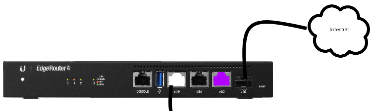

.. _edgerouter-vlan-setup:

Edgerouter VLAN Setup
#####################
This will setup the edgerouter in a `router on a stick`_ configuration using
VLANs, with no subnet restrictions (these will be applied after setup).
:ref:`example-network-diagram`.

.. aafig::
  :name: Example VLAN Networking Using ER-4.

         'Edgerouter ER-4'
  +-----------------------------+
  | +----+ +----+ +----+ +----+ |
  | |eth0| |eth1| |eth2| |eth3| +
  | +----+ +----+ +----+ +----+ |
  +---+--------------------+----+
      |                    |
     ++                'Internet (eth3)'

Reset & Login to Router
***********************
#. Factory reset edgerouter.
#. Connect *eth1*, set laptop static ``192.168.1.5``, gateway: ``192.168.1.1``.
#. Connect to Edgerouter GUI @ http://192.168.1.1.

   * Default credentials: ``ubnt``/``ubnt``.

Basic Setup Wizard
******************
Basic Setup (Basic Setup is the same as *WAN+2LAN2*).

.. gui::   Configure WAN / Internet port
  :label:  Ubiquiti
  :path:   Internet (eth3/SFP)
  :value0: ☑, Static IP
  :value1: › Address, {IP_PUB_MASK}
  :value2: › Gateway, {GATEWAY}
  :value3: › DNS, 1.1.1.1
  :value4: ☐, Internet connection is on VLAN
  :value5: ☑, Enable the default firewall
  :value6: ☐, Enable DHCPv6 Prefix Delegation
  :value7: ☐, Bridge LAN interfaces into a single network

.. gui::   Configure LAN Management Ports
  :label:  Ubiquiti
  :path:   LAN Ports (eth2)
  :value0: Address, 192.168.2.1 / 255.255.255.0

  .. note::
    This will become static management port for the router, in case anything
    happens.

.. gui::   Configure New Admin User
  :label:  Ubiquiti
  :path:   User Setup
  :value0: Username, {USER}
  :value1: Password, {PASS}

Apply and reboot router.

.. hint::
  The reason to use the SFP connection for Internet is to make it physically
  distinguishable from the rest of the ports on the router, even if it just
  converted immediately to ethernet.

Setup VLANs on eth0
*******************
#. Set laptop DHCP. Connect to *eth2*.
#. Connect to Edgerouter GUI @ http://192.168.1.1.

.. gui::   Configure Host and Domain
  :label:  Ubiquiti
  :path:   Management Settings --> System
  :value0: Host Name, {HOST}
  :value1: Domain Name, {DOMAIN}
  :value2: ☐, Ubntu Discovery

.. gui::   Configure SSH Server
  :label:  Ubiquiti
  :path:   Management Settings --> SSH Server
  :value0: ☑, Enable
  :value1: Port, {SSH_PORT}

.. gui::   Define Management Network on Interfaces
  :label:  Ubiquiti
  :path:   Dashboard --> eth0 --> Actions --> Config
  :value0: Address, Manually define IP address
  :value1: Address, 10.1.1.1/24

.. important::
  This handles untagged traffic coming into the router; this is the
  :term:`Management VLAN` network.

.. gui::   Add Wired Network VLAN
  :label:  Ubiquiti
  :path:   Dashboard --> Add Interface --> Add VLAN
  :value0: VLANID, 2
  :value1: Interface, eth0
  :value2: Description, {DESCRIPTION}
  :value3: Address, Manually define IP address
  :value4: Address, 10.2.2.1/24

.. warning::
  Add all VLANS using the :ref:`VLAN Table <vlan-table>` to *eth0*.
  :term:`Management VLAN` is not explicitly defined as a VLAN -- untagged
  traffic coming into *eth0* **IS** management traffic.

.. _edgerouter-vlan-setup-dns:

Setup DHCP & DNS for VLANs
**************************

.. gui::   Add DHCP Server for Each Network
  :label:  Ubiquiti
  :path:   Services --> DHCP Server --> Add DHCP Server
  :value0: DHCP Name, Wired
  :value1: Subnet, 10.2.2.0/24
  :value2: Range Start, 10.2.2.10
  :value3: Range End, 10.2.2.240
  :value4: Router, 10.2.2.1
  :value5: DNS 1, 10.2.2.1
  :value6: Domain, {DOMAIN}
  :value7: Domain, ☑ Enable

.. warning::
  Add DHCP for all VLANS. For the *management* DHCP server, set the *Unifi
  Controller* field to the IP for the permanent Unifi Controller and not your
  laptop.

:cmdmenu:`Services > DNS > Interface > Add Listen Interface`

.. note::
  Add for all networks and VLANS. VLANS will appear as *eth0.vlanid*.

Confirm Management Network Working
**********************************
* Connect laptop to *eth0*.
* Laptop should pull a :term:`Management VLAN` network address, with the gateway
  *10.1.1.1*. This means untagged traffic is being properly assigned to the
  management network.

.. _router on a stick: https://help.ui.com/hc/en-us/articles/204959444-EdgeRouter-Router-on-a-Stick
