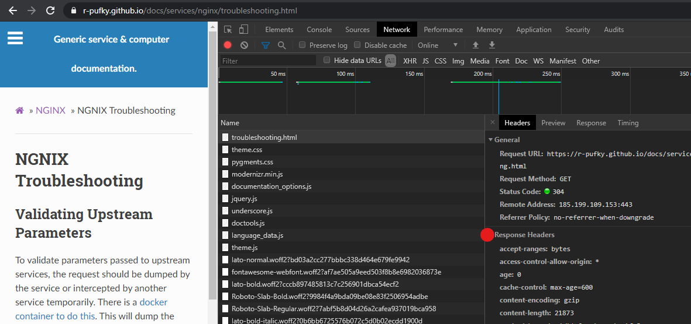

.. _service-nginx-troubleshooting:

NGNIX Troubleshooting
#####################

Validating Upstream Parameters
******************************
To validate parameters passed to upstream services, the request should be
dumped by the service or intercepted by another service temporarily. This will
dump the received headers from both http and https communication to the
upstream service.

.. code-block:: yaml
  :caption: **0640 root root** ``docker-compose.yml``

  http-echo:
    image: mendhak/http-https-echo

.. code-block:: nginx

  location / {
     proxy_pass http://http-echo/;
  }

.. note::
  Headers will be dumped directly to the page.

`Reference <https://github.com/mendhak/docker-http-https-echo>`__

.. _service-nginx-debug-nginx-configs:

Debug NGINX configs
*******************
There is no existing logging functionality in NGINX to write directly to logs
from configuration files. Work around by directly injecting debugging headers
in configuration files to dump information to logs. NGINX variables may be used
as well.

.. code-block:: nginx

  add_header X-debug-message "some message to write $ssl_client_s_dn" always;

Headers are found in the page response.

`Reference <https://serverfault.com/questions/404626/how-to-output-variable-in-nginx-log-for-debugging>`__

.. _if-is-evil:

If is Evil
**********
If operates as a rewrite and is **inherently misunderstood**.

Within a location block the only **safe** operations are:

* ``return``.
* ``rewrite``.

**All** if operations must be explicitly tested for appropriate behavior.
Other references for other "evil" examples.

`Reference <https://www.nginx.com/resources/wiki/start/topics/depth/ifisevil/>`__

`Reference <https://agentzh.blogspot.com/2011/03/how-nginx-location-if-works.html>`__

`Reference <https://serverfault.com/questions/687033/nginx-use-geo-module-with-allow-deny-directives>`__

Dump Loaded NGINX Configuration
*******************************
Dump the currently loaded configuration in config file formatting. Useful to
inspect current nginx state.

.. code-block:: bash

  nginx -T

`Reference <https://stackoverflow.com/questions/12832033/dump-conf-from-running-nginx-process>`__

NGINX Queries Originate from Wrong Gateway
******************************************
NGINX express this bug by forwarding/proxying any traffic **over** the default
gateway for the first lexical named network that appears. This results in
non-deterministic source IP routing.

Set an appropriate default gateway in the networking config.

`Reference <https://github.com/moby/moby/issues/21741>`__

`Reference <https://github.com/docker/libnetwork/issues/1141#issuecomment-215522809>`__

Forward Traffic via Specific Interfaces
***************************************
NGINX can forward traffic via specific interfaces for *location* definitions.

Use IPv4 address in ``proxy_bind`` command for specific locations.

.. code-block:: nginx

  location / {
    proxy_bind {NGINX NETWORK IP};
    proxy_pass ...
  }

`Reference <https://docs.nginx.com/nginx/admin-guide/web-server/reverse-proxy/#proxy_bind>`__
